# Monte Carlo Path Tracing

Part of [Brown University CSCI2240](https://dritchie.github.io/csci2240/) assignment.


## Description


This project contains code to perform Monte Carlo Path Tracing written in C++ and was built on top of the Stencil code
provided to us by the instructors of CSCI2240.

## Requirements

```
Qt ( > 5.9.0)
Qt Creator ( > 4.5.0)
OpenMP
```

## Implementation

#### Four basic types of BRDFs ​✔

**Diffuse [640 x 640] [2000 Samples]**

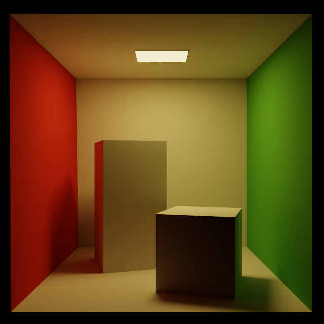


**Mirror [640 x 640] [2000 Samples]**

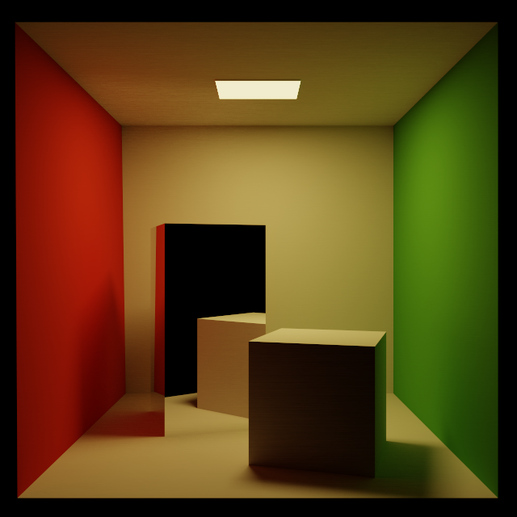


**Glossy [640 x 640] [3000 Samples]**

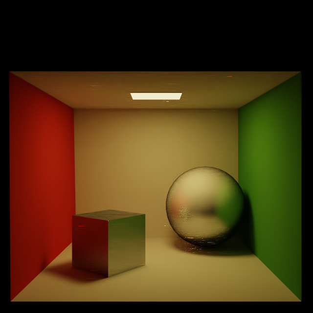

 
 **Refraction [640 x 640] [1500 Samples]**
 
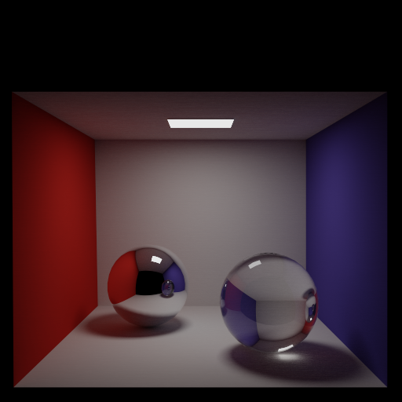


#### Soft Shadows and Indirect Illumination ​✔

Soft Shadows and Colour Bleeding Caustics

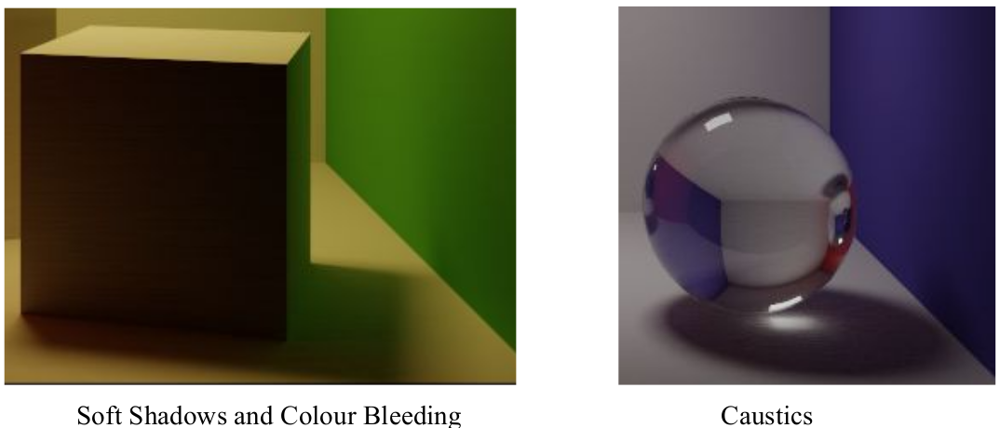


#### Russian Roulette path termination ​✔

#### Tone Mapping ​✔

#### Event splitting ​✔

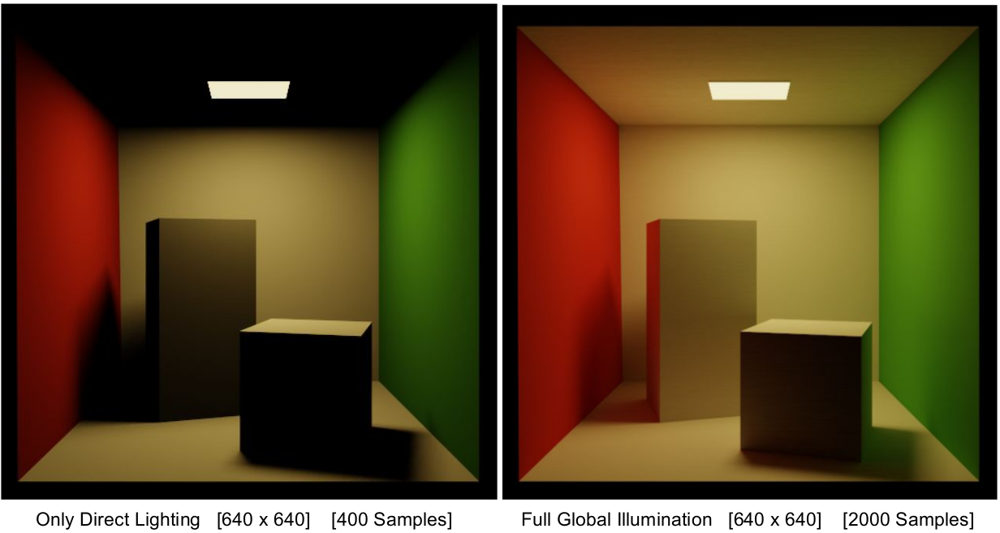

## Extra Features

#### Attenuate refracted paths ​ ​✔

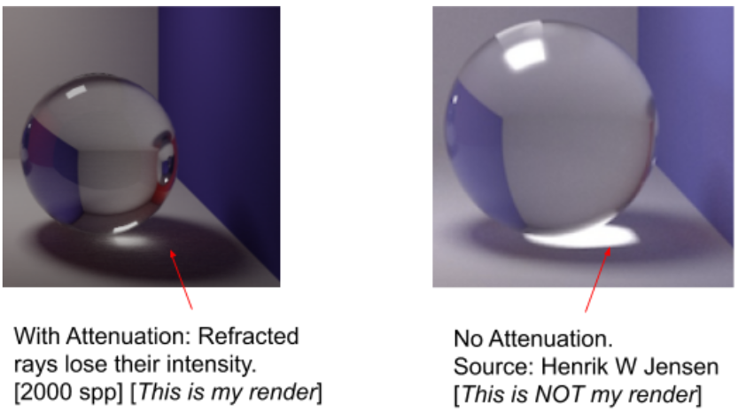

Reference : https://www.scratchapixel.com/lessons/3d-basic-rendering/global-illumination-path-tracing

#### Importance Sampling ​✔

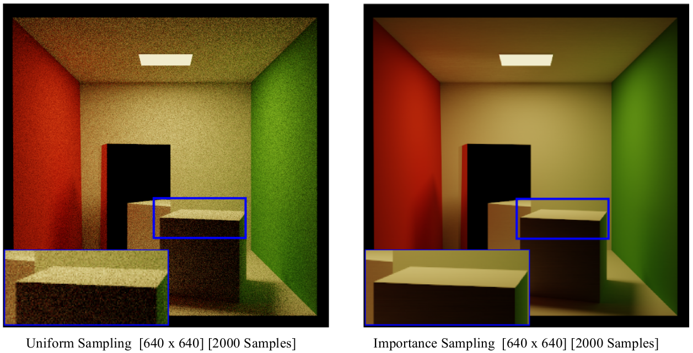

With importance sampling, the path tracer converges within 2000 samples per pixel, while the naive uniform sampling
technique still produces noise for the same samples per pixel.

Reference: https://www.tobias-franke.eu/log/2014/03/30/notes_on_importance_sampling.html


#### Depth of field ​✔

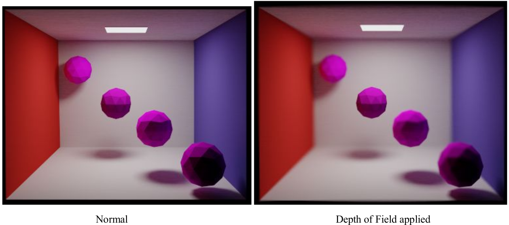
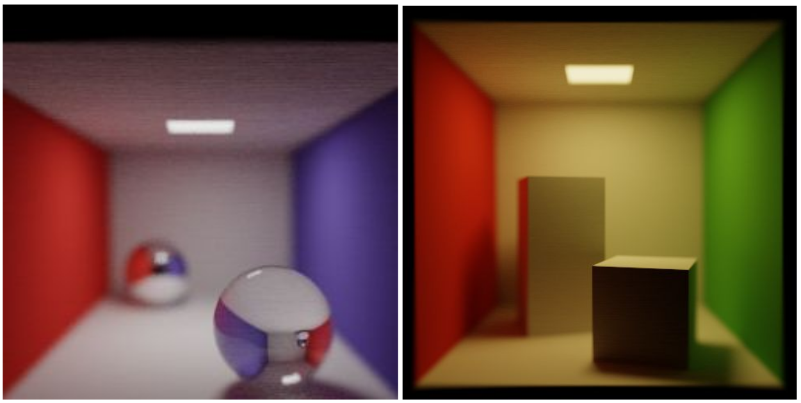


## Other Scenes

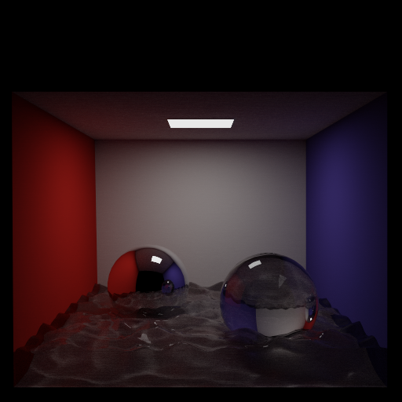
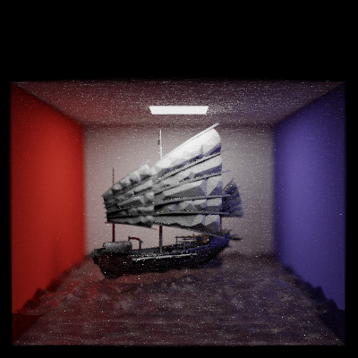


## Usage

#### Build :

- Using Qt Creator.
- Using CLI:

```
cd Path_Tracer
mkdir build
cd build
qmake -makefile ../path-stencil.pro
make -j
```

#### Run :

- Using Qt Creator
Set the following arguments in Qt Creator.
```
# <path to xml file> <rendered image path> <number of samples> <image height> <image width>
../Path_Tracer_2240/example-scenes/CornellBox-Sphere.xml ./output.png 100 256 256
```
- Using CLI :
```./path-stencil ../Path_Tracer_2240/example-scenes/CornellBox-Sphere.xml ./output.png 100 256 256```


